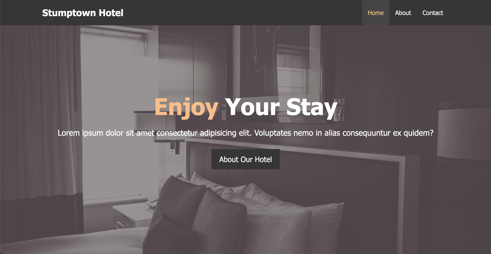

# _Hotel Website_

#### This is hotel website for a hotel in Portland, Oregon. This was made using HTML and CSS.

#### _07/2021_

#### By _**Chris Korsak**_

## Description

This hotel website is a project from [Modern HTML and CSS From The Beginning](https://www.udemy.com/course/modern-html-css-from-the-beginning/learn/lecture/13285364#overview) cousre on Udemy. It uses floats to teach legacy page layout principles. Additionally, it incorporates [Font Awesome](https://fontawesome.com/) icons and stock images from [pexels.com](https://www.pexels.com/).

## Setup/Installation Requirements

* None. This application is also hosted on Github pages. Check out the app [here!](https://chriskorsak.github.io/hotel-website/)

## Technologies Used

* HTML
* CSS
* Font-Awesome font icons  
* Stock images from Pexels.com
